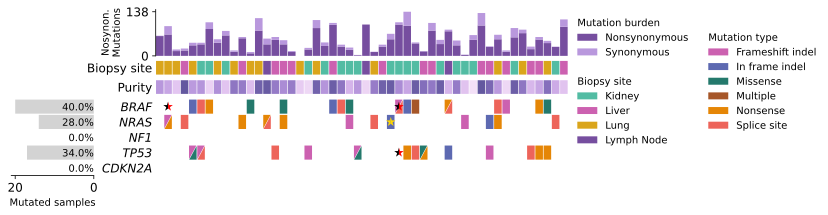
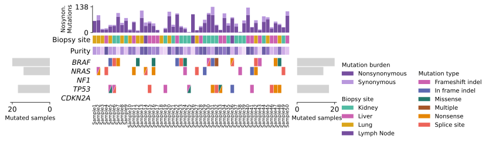
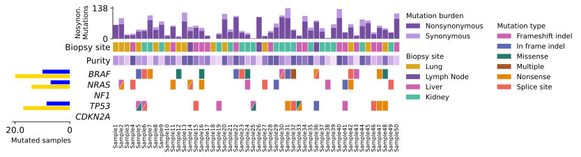

# CoMut
[](https://opensource.org/licenses/MIT)
[](https://codecov.io/gh/ypradat/comut)

CoMut is a Python library for creating comutation plots to visualize genomic and phenotypic information.


## Installation

The original version (v0.0.3) of `comut` is available on pypi [here](https://pypi.org/project/comut/) and can be
installed via `pip install comut`.

This version is not yet available on `pypi` and may be installed via cloning of this repository on your session and then

```
pip install -e /path/to/this/repo
```

## Colab Quickstart

For those who do not want to install Python or other packages, there is a [Google Colab
notebook](https://colab.research.google.com/github/vanallenlab/comut/blob/master/examples/quickstart.ipynb) where you
can simply upload a [MAF](https://software.broadinstitute.org/software/igv/MutationAnnotationFormat) file and run the
notebook to make a basic comutation plot. This file is also available as a [jupyter
notebook](https://github.com/vanallenlab/comut/blob/master/examples/quickstart.ipynb) for local use. 

## Citation 

CoMut is now published
[here](https://academic.oup.com/bioinformatics/article/doi/10.1093/bioinformatics/btaa554/5851837). If you use CoMut in
a paper, please cite: 
> Crowdis, J., He, M.X., Reardon, B. & Van Allen, E. M. CoMut: Visualizing integrated molecular information with
comutation plots. Bioinformatics (2020). doi:10.1093/bioinformatics/btaa554

## Documentation

There is also a [Documentation notebook](https://github.com/vanallenlab/comut/blob/master/examples/documentation.ipynb)
that provides documentation for CoMut. It describes the fundamentals of creating comutation plots and provides the code
used to generate the comut above.

## Development

If you would like to report a bug or request a feature, please do so using the [issues page](https://github.com/vanallenlab/comut/issues)

## Dependencies

CoMut runs on python 3.6 or later. CoMut requires the following packages as dependencies (they will be installed along with CoMut if using `pip`)

```
numpy>=1.18.1
pandas>=0.25.3
palettable>=3.3.0
matplotlib>=3.3.1
```

## Versions

1.0.0 - Multiple changes
- Add arguments in the like of `xtick_style`, `xtick_fontdict`, `xtick_show`, `xtick_rotation`, `xlabel`,
`xlabel_fontsize`, `xlabel_fontweight` to the functions `add_categorical_data`, `add_continuous_data`, `add_bar_data`.
- Add functions `add_scatter_data`, `_plot_scatter_data` for drawing symbols on selected tiles (see example 2 below).
- Add functions `add_side_error_data`, `_plot_side_error_data` for drawing an error bar plot (see example 4).
- Modify `_plot_side_bar_data` to allow for grouped bars in `unstacked` mode. Add arguments to the function
  `add_side_bar_data` to control for the heights and gaps between the bars.


0.0.3 - No code is changed, description updated for public release  
0.0.2 - Introduce compatibility for Python 3.6  
0.0.1 - Initial release

## Examples

For the full code underlying these examples, see in `tests/test_comut`.
 
### Example 1

Basic example. 


### Example 2

As compared to example 1, star symbols are added on certain cells and percentage labels were added on the left bar plot.
Observe that the star sometimes are composed of 2 colors. Additionally, xtick labels of the central plot have been
hidden.




### Example 3

As compared to example 2, add a bar plot on the right.




### Example 4

As compared to example 3, replace the right bar plot by a right error bar plot.


### Example 5

As compared to example 4, add another bar plot right of the right bar plot.


### Example 6

As compared to example 1, replace a simple bar plot by grouped bar plot.


